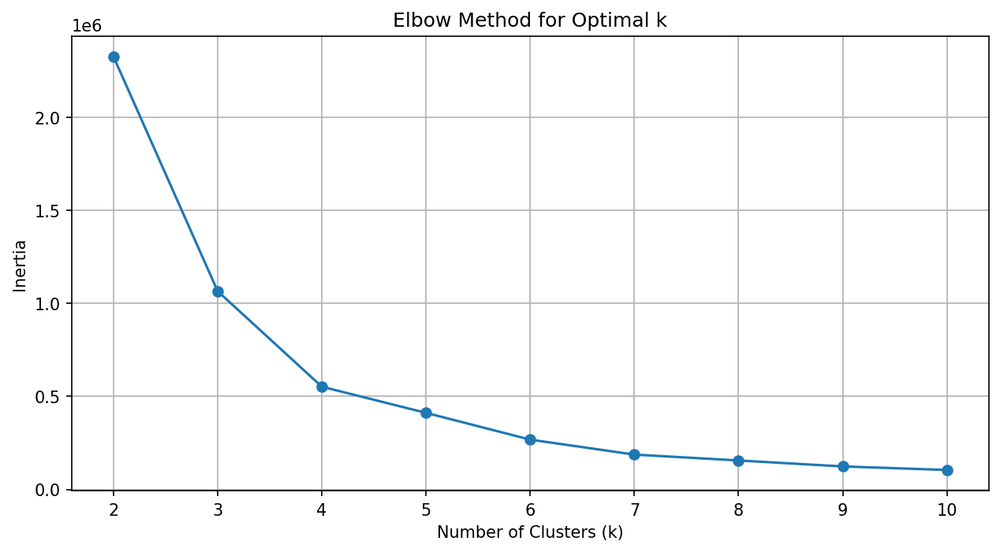
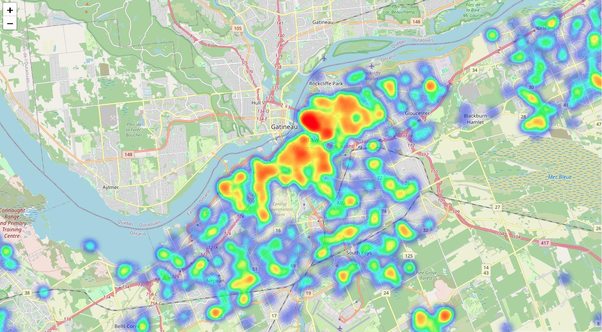
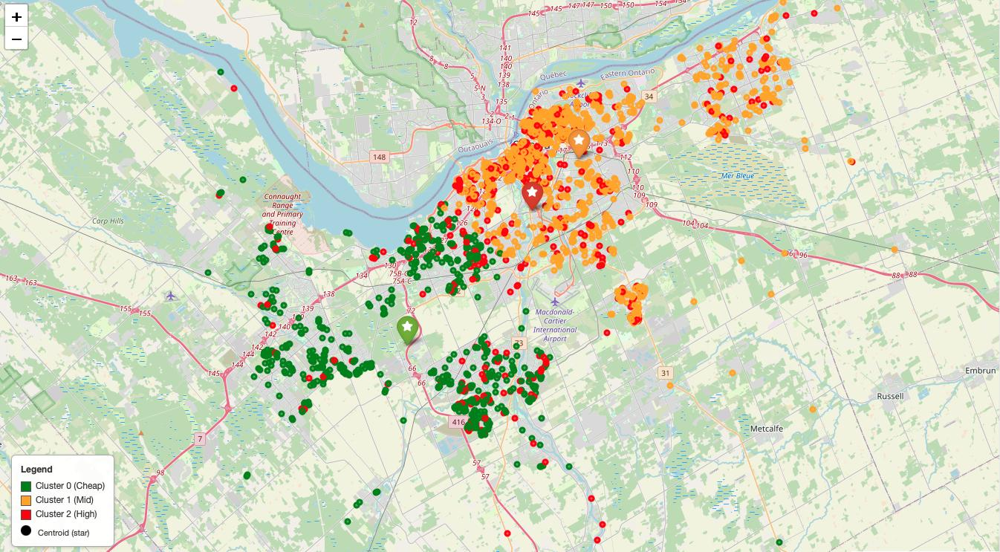

# Ottawa Airbnb Price Clustering Analysis

## Project Overview
This project analyzes Airbnb listings in Ottawa to identify distinct price clusters using data science techniques. 
The workflow covers data collection, cleaning, exploratory data analysis (EDA), clustering, and final insights. 
It aims to provide a clear picture of how Airbnb accommodations are priced across different neighborhoods in Ottawa.

---

## Data Collection
- Dataset: `DATA AIRBNB.csv` (Airbnb listings in Ottawa in 2023) .
  - Dataset taken from : https://insideairbnb.com/get-the-data/
- Key variables include **price**, **latitude**, **longitude**, and other listing details.
- Data cleaning was performed to handle missing values, remove duplicates, and standardize formats.

---

## Exploratory Data Analysis (EDA)
- **Price distribution** was examined to understand the spread of Airbnb rates across Ottawa.
- **Geographical visualization**: Plotted listings on a map to see price concentration in downtown vs suburban areas.
- **Outlier detection**: Identified unusually high/low listings and treated them accordingly.
- **Descriptive statistics**: Mean, median, and variance of prices across the dataset.

---

## Clustering
- **Methodology**: Applied K-Means clustering using **price, latitude, and longitude** as features.
- **Number of clusters**: Determined optimal clusters using the **elbow method** and selected **3 clusters**.
  - 
- **Clusters identified**:
    | Cluster | Color  | Description                   | Price Range | Avg. Price | Interpretation |
    |---------|--------|-------------------------------|-------------|------------|----------------|
    | 2       | 🔴 Red   | High Price accommodations     | $127 – $271 | $187.9     | Narrow range → Premium or luxury stays, entire homes/apartments in prime locations |
    | 1       | 🟡 Yellow | Mid Priced accommodations     | $18 – $171  | $86.0      | Wide range → Mix of budget-friendly & moderately priced stays, some very affordable options |
    | 0       | 🟢 Green  | Cheap / Budget accommodations | $25 – $225  | $83.34     | Very wide range → Mostly budget-friendly stays, but includes some higher-priced listings |

## Visualization: Plots and heatmaps showing geographic distribution of clusters.
### Geographical Heatmap of the Airbnb listings in Ottawa
  [View interactive map version](https://hilfritz.github.io/AirBNB_Otawa_DataAnalysis/FIGURES/ottawa_airbnb_cluster_heatmap.html)
  
### Geographical Distribution of Airbnb listings with clusters in Ottawa (with centroids)
  [View interactive map version]([FIGURES/ottawa_clusters_map_with_centroids_legend.html](https://hilfritz.github.io/AirBNB_Otawa_DataAnalysis/FIGURES/ottawa_clusters_map_with_centroids_legend.html))
  

---

## Findings & Insights
- **Cluster 2 (High Price)**: Concentrated in prime locations, likely luxury homes/apartments.
- **Cluster 1 (Mid Price)**: Represents a mix of budget and moderately priced listings with wide variability.
- **Cluster 0 (Low Price)**: Surprisingly includes some higher-priced outliers, possibly due to irregularities in listing descriptions or cleaning steps.
- **Overall trend**: Prices increase towards central/downtown Ottawa, while affordable listings are more scattered in outer neighborhoods.

---

## Tools & Libraries Used
- **Python**: Pandas, NumPy, Matplotlib, Seaborn, Folium, Scikit-learn.
- **Notebook Environment**: Jupyter Notebook.

---

## Next Steps
- Enhance dataset with more features (room type, number of reviews, availability).
- Experiment with other clustering algorithms (DBSCAN, Hierarchical Clustering).
- Build an interactive dashboard for users to explore clusters dynamically.

---

## Author
Hilfritz Camallere
Prepared as part of a Data Analytics project to demonstrate clustering and visualization skills for data analysis.

